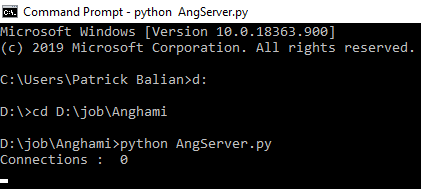
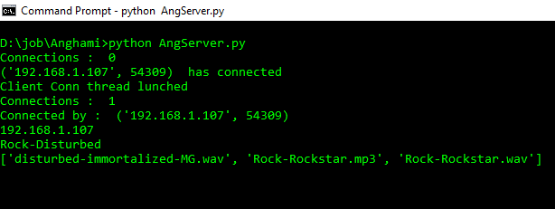
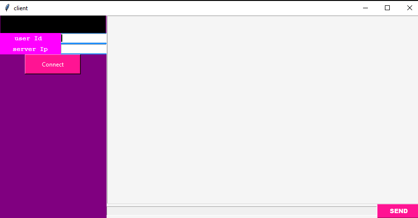
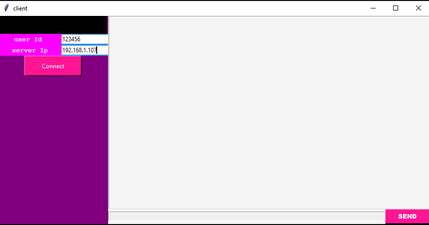
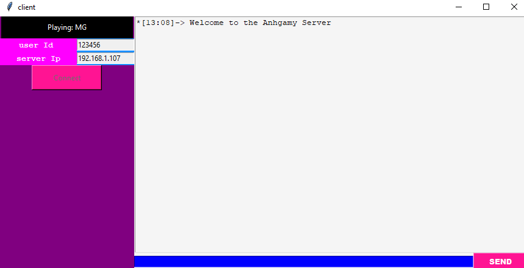
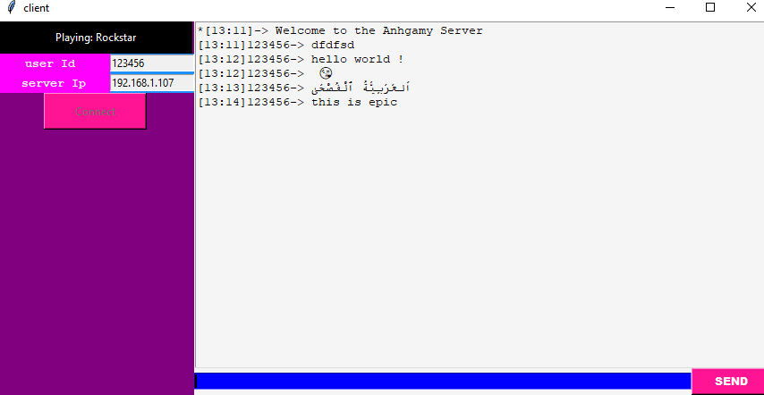
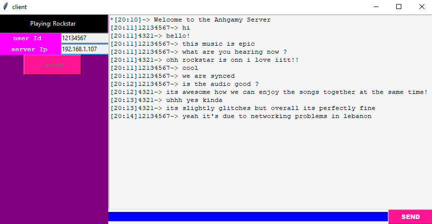

# anghamy-station


A client-server architecture that automatically groups you depending on your music taste and creates rooms in which music is synced and where users can chat together.

### Server will :

* Match users music tastes (Anghami likes)
* Categorize users (by groups of music taste)
* Host chat rooms for the users groups(tcp)
* Play songs to groups like a radio(udp)
* Send now current playing song
* Receive messages from clients and broadcast them to all clients in the same group as the sender(tcp)
### Clients will :
* Communicate with the server(tcp)
* Show GUI 
* Receive messages and show them on GUI(with time stamps)
* Stream songs from server (with a buffer)(udp)
* Show current playing song
* Send messages to server(tcp)
## Server
### Setup
```
import requests
import pyaudio
from pydub import AudioSegment
```
these are the external libraries that need to be installed along with ffmpeg.

**N.B pyaudio needs a wheel from : [here](https://www.lfd.uci.edu/~gohlke/pythonlibs/#pyaudio)**

In the folder ,where the server python file is , a songs folder should exist containing only .mp3 or .wav files .
The mypath variable should be changed according to the current path of the server file :
```
PORT=55000
MusicPort=65000
userGroups={}
users={}
usercon=[]
frames=[]
FORMAT = pyaudio.paInt16
CHUNK = 1024
CHANNELS = 2
RATE = 44100
mypath="D:\\job\\Anghami\\songs\\"
```
example : `“Drive:\\some_directory\\the_server_directory\\songs_directory”`

**N.B: Server ip should be static and ports must be forwarded on router if you want to operate on a WAN.**

Server ip must be changed according to its fixed static ip in the code:
`testip="192.168.1.107" #sever ip`

## Launching the server:
To be able to launch the server on WAN networking must be in optimal conditions ,so port in use 55000 and 65000 , must be forwarded and server must have a static ip.
Step 1: Lunching in terminal 
While in the server directory , simply type :
```
python AngServer.py
```
##### When server has lunched , it will look like this while waiting for a connection :


### Waiting for user connection :

##### When a user connects to the server:


As you can see a client has connected and it has the following ip address : `192.168.1.107`.
After communicating with the Anghami API the server has categorized ,according to what the user liked , and added it to the Rock-Disturbed group.
In the example above Rock is the most liked genre and Disturbed is the most recurrent keyword .

### Building group playlist
After the first user joins a group , the server will build a playlist according to the users group preference .

**N.B: the file names of the songs should be in the following format :**

`Genre` **or** `keywords(separated by ’-’)`**-**`song name`**.**`mp3` **or** `wav`

Example : `rock-disturbed-sound of silence.mp3`

### Group radio start
Once the playlist has been built the server starts streaming the music to the group of clients (using udp) , like an internet radio .
Clients joining in later will hear what is currently playing exactly like a radio .
## Client 
### Setup :
```
import requests
from gui import Gui
import pyaudio
```
these are the external libraries that need to be installed .

**N.B pyaudio needs a wheel from : [here](https://www.lfd.uci.edu/~gohlke/pythonlibs/#pyaudio)**

In the client directory the following files should be present :
* `gui.py`
* `access token.txt` in which only the user access token must be stored

### Launching the client:
#### Lunching in terminal 
While in the client directory , simply type : 
```
python AngClient.py
```
### GUI
#### Once launched you will be greeted with the following interface :


##### The user must first input his Anghami ID then the server ip or domain name if it was setup on the server (other input boxes are disabled).


#### Connect
After entering the user id and the server ip, the user should click on connect to be connected to the server.

#### Greeting message 


Once connected user id ,server ip and connect will be disabled .
A message saying : `welcome to Anghamy server`, will be received and displayed .

In the top left label the current song being played will be displayed.

#### Start chatting while listening to music
##### In the blue entry box users can type their message and send it to the server which directly broadcasts it to the group  .


### Conversation between 2 users:


Anghami 2020 intern challenge.


## Fully built with Python 3.8
## License
This project is licensed under the GPL-3.0 License - see the [LICENSE.md](LICENSE.md) file for details

